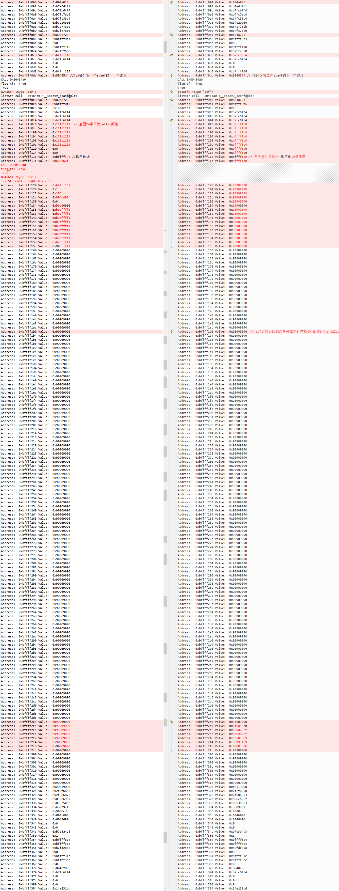

# Document

## Host Machine Part

### use volatility Framework, You need to install following:

[volatility github](https://github.com/volatilityfoundation/volatility/wiki/Installation)

1. **python 2.7**
    - sudo pip install py-bcrypt
    - sudo pip install utils
    - sudo apt-get install python-tk
2. **distorm3**
    - [Official document](https://github.com/gdabah/distorm/releases)
    - sudo python setup.py build
    - sudo python setup.py install
3. **pycrypto-2.6.1**
    - [Official document](https://www.dlitz.net/software/pycrypto/)
    - sudo apt-get install python-dev
    - sudo python setup.py build
    - sudo python setup.py install
4. **yara**
    - [Official document](https://yara.readthedocs.io/en/v3.7.0/gettingstarted.html)
5. **jpype**
    - [Official document](https://github.com/originell/jpype/releases)
6. **setuptool**
    - pip install setuptool
7. **elftools**
    - pip install pyelftools
8. **paramiko**
    - pip install paramiko
9. **libvmi-0.10.1**
    - *Recommended package libvmi-0.10.1, Other versions may have problems when compiling*
    - [Official document](https://github.com/libvmi/libvmi)
    - ./autogen.sh
    - sudo apt-get install libgnomeui-dev
    - sudo apt-get install check-devel
    - sudo apt-get install libvirt-dev
    - ./configure --enable-xen=no
    - make
    - sudo make install
    - cd tools/pyvmi/
    - sudo python setup.py build
    - sudo python setup.py install
    - ldconfig

## Virtual machine Part

1. Install JDK 1.7
2. To analyze Java programs, you need to send the following packets to the virtual machine.
   - pyagent.jar
   - Test.jar
3. To analyze C programs
   - [buffer-overflow-attack](https://github.com/theChildinus/buffer-overflow-attack) folder

## The project needs to be adjusted (Host Machine Part)

1. pyCharm Running project
    - Encountered an error message `ImportError: libvmi-0.9.so: cannot open shared object file: No such file or directory`
    - in file `/etc/profile.d/jdk.sh` add `export LD_LIBRARY_PATH=$LD_LIBRARY_PATH:/usr/local/lib`
2. in path `JavaMemory/volatility-2.6/volatility/plugins/linux`
   - `linux_runtime_py` Used to analyze Java programs
   - `linux_memory_analyze.py` Used to analyze C programs
3. `linux_runtime.py` The path that needs to be modified are：

    | variable name   | Default             |
    | --------------- | ------------------- |
    | j_test_path     | -Djava.class.path=/home/kong/JavaMemory/JDI/out/artifacts/JDI_jar/JDI.jar |
    | symbol          | /home/kong/JavaMemory/jdk1.7.0_79/jre/lib/amd64/server/libjvm.so          |
    | self.symbolDict | /home/vm/jdk1.7.0_79/jre/lib/amd64/server/libjvm.so                       |
4. `linux_memory_analyze.py` needs to be modified are：

    | variable name   | Default    |
    | ----------- | -------------- |
    | in function `calculate`, processname | `./stack` You need to modify this bye C program name for analysis |

5. JDI project needs to import package:

- `jdk1.7.0_79/lib/sa-jdi.jar`
- `JavaMemory/JDI.jar`

JDI package method in IDEA[reference](https://www.jianshu.com/p/2e06dd2ea4da)

To extract official data packets `JDI.jar` and `sa-jdi.jar` into the project by `Extracted Directory` option

## Test Volatility is available

- **Test whether the virtual machine process information can be obtained through VolatilitVy Framework**
  - Pycharm Edit Configuration (If the virtual machine is 64-bit) `-l vmi://ubuntu --profile=LinuxUbuntu1604_139x64 linux_pslist`
  - （If the virtual machine is 32-bit） `-l vmi://ubuntu12.04_32bit --profile=LinuxUbuntu1204_23x86 linux_pslist`
  - Where `vmi` represents the name of the virtual machine, `profile` represents the name of the profile generated in the virtual machine, and `x64, x86` represents the number of virtual machines.
  - Running the program, if the virtual machine process information is not displayed, the virtual machine kernel version may not match the compressed package in the overlays directory. In the virtual machine, check the kernel version by `uname -a` and perform the following steps to generate the profile. [Reference official document](https://github.com/volatilityfoundation/volatility/wiki/Linux)(in Virtual machine)：
    1. Send the volatility folder to the virtual machine
    2. `sudo apt-get install dwarfdump`
    3. `sudo apt-get install build-essential`
    4. It is recommended to disable the kernel automatic upgrade, stop the update in the settings, and `sudo apt-mark hold KernelVersion`
    5. `cd volatility/tools/linux` and `make`
    6. `head module.dwarf`
    7. `sudo zip volatility-2.6/volatility/plugins/overlays/linux/Ubuntu<SystemVersion>_<KernelVersion>.zip volatility-2.6/tools/linux/module.dwarf /boot/System.map-<KernelVersion>`
    8. Copy the generated zip file to the host path `volatility-2.6/volatility/plugins/overlays/linux`, and Edit Configuration in PyCharm

## Running process

### Analyze Java programs

1. Virtual machine execution command `java -jar -Xint Test.jar`
2. Create a new terminal in the virtual machine. Run the `jps` command to obtain the process ID corresponding to the jar. and `sudo java -jar pyagent.jar ID`
3. In Host machine Edit Configuration `-l vmi://ubuntu --profile=LinuxUbuntu<SystemVersion>_<KernelVersion>x64 linux_runtime -p <process ID>` and run

### Analyze C programs

1. The virtual machine executes the command `./stack` to run the test program.
2. In Host machine Edit Configuration `-l vmi://ubuntu12.04_32bit --profile=LinuxUbuntu<SystemVersion>_<KernelVersion>x86 linux_memory_analyze -p <process ID>` and run

If the prompt `waiting connection...` is called, this project is the socket server, waiting for the IOT project as the client connection, the relevant code can be ignored.

## JDI

This folder is a java interface implementation, called by jpype when performing memory analysis through Volatility Framework.

## JDI_Local

This folder is the code for Java memory analysis in local. The running process is：

- Root permission to open the `JDI_Local` folder in IDEA
- add `jdk1.7/lib/sa-jdi.jar`
- Enter the directory `jdk1.7/bin`, run `./java -jar -Xint path/of/test.jar`
- use `jps` get the test program process number and modify the cmd variable value in the code
- **The test program needs to call the `Thread.sleep()` function, otherwise the Volatility framework cannot get the memory information.**

## [buffer-overflow-attack](https://github.com/theChildinus/buffer-overflow-attack)

In the picture, the left side is the stack before the buffer overflow attack, and the right side is the stack situation after the attack.

## Q & A

1. Recommend：
    - [HotSpot Serviceability Agent 实现浅析](https://yq.aliyun.com/articles/20231)
    - [JVM 内存模型概述](https://blog.csdn.net/justloveyou_/article/details/71189093)
    - [doc Serviceability Agent](https://docs.oracle.com/javase/jp/8/docs/serviceabilityagent/)
    - [x86-64 下函数调用及栈帧原理](https://zhuanlan.zhihu.com/p/27339191)
